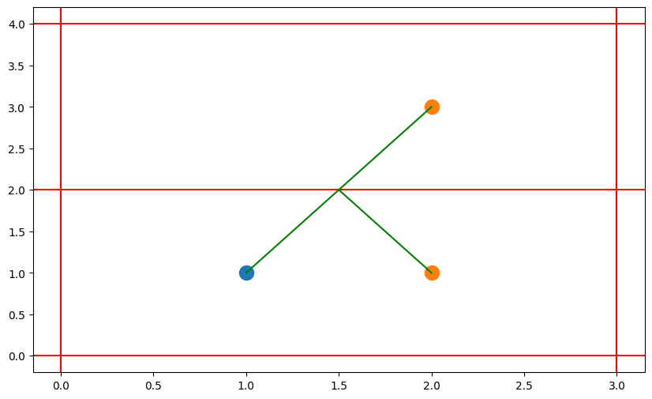
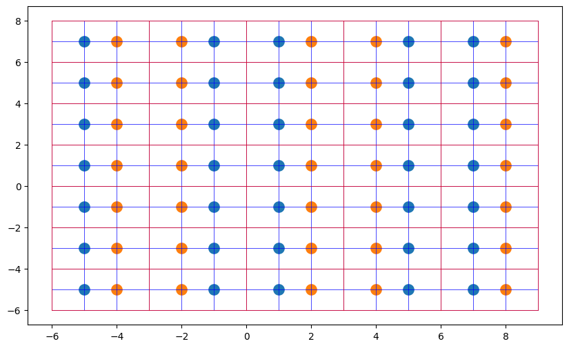

# Bringing a gun to a trainer fight

## Problem statement

Uh-oh - you've been cornered by one of Commander Lambdas elite guards! Fortunately, you grabbed a beam weapon from an abandoned guard post while you were running through

the station, so you have a chance to fight your way out. But the beam weapon is potentially dangerous to you as well as to the elite guard: its beams reflect off walls, meaning you'll have to be very careful where you shoot to avoid bouncing a shot toward yourself! Luckily, the beams can only travel a certain maximum distance before becoming too weak to cause damage. You also know that if a beam hits a corner, it will bounce back in exactly the same direction. And of course, if the beam hits either you or the guard, it will stop immediately (albeit painfully).

Write a function solution(dimensions, your_position, guard_position, distance) that gives an array of 2 integers of the width and height of the room, an array of 2 integers of your x and y coordinates in the room, an array of 2 integers of the guard's x and y coordinates in the room, and returns an integer of the number of distinct directions that you can fire to hit the elite guard, given the maximum distance that the beam can travel.

The room has integer dimensions `[1 < x_dim <= 1250, 1 < y_dim <= 1250]`. You and the elite guard are both positioned on the integer lattice at different distinct positions (x, y) inside the room such that `[0 < x < x_dim, 0 < y < y_dim]`. Finally, the maximum distance that the beam can travel before becoming harmless will be given as an integer 1 < distance <= 10000.

For example, if you and the elite guard were positioned in a room with dimensions [3, 2], your_position [1, 1], guard_position [2, 1], and a maximum shot distance of 4, you could shoot in seven different directions to hit the elite guard (given as vector bearings from your location): [1, 0], [1, 2], [1, -2], [3, 2], [3, -2], [-3, 2], and [-3, -2]. As specific examples, the shot at bearing [1, 0] is the straight line horizontal shot of distance 1, the shot at bearing [-3, -2] bounces off the left wall and then the bottom wall before hitting the elite guard with a total shot distance of sqrt(13), and the shot at bearing [1, 2] bounces off just the top wall before hitting the elite guard with a total shot distance of sqrt(5).

## Test cases

```py
Input:
solution.solution([3,2], [1,1], [2,1], 4)
Output:
7

Input:
solution.solution([300,275], [150,150], [185,100], 500)
Output:
9
```

## Solution

Instead of trying to create a physical bullet that can bounce, expanding the space, aka `mirroring`, should be much easier. 

<p align="center">
  
  Fig.1 shows the nature of bouncing in mirrored object
</p>

As shown in the first figure, the player and the guard are positioned at `[1, 1]` and `[2, 1]` respectively, while, `[2, 3]` shows the mirrored guard. From `player perspective`, if you shoot to the direction of `[1, 2]`, the bullet will bounce when it hits the upper wall and hit the guard. In imaginary domain, aka `mirrored domain`, the bullet flies straight and hit the mirrored guard at `[2, 3]`. As you can see `the distance and angle from player` is still the same when aiming to the mirrored guard, but the difficulty is lower than trying to bounce it. `With mirrored objects`, you can just find `all possible position` of each persons and calculate `distance and angle from player`.

Figure below shows mirroring of the first given test case, in which `red line` shows the extent of the room, `blue dot` shows the player, `orange dot` shows the guard and the `center is the actual room` or the reality

<p align="center">
  
  Fig.2 shows an example of mirroring
</p>

To solve the question, `Find all possible position and calculate distance and angle from player's original position`. Filtered out all impossible target `(a target that is too far or is blocked)` and count.